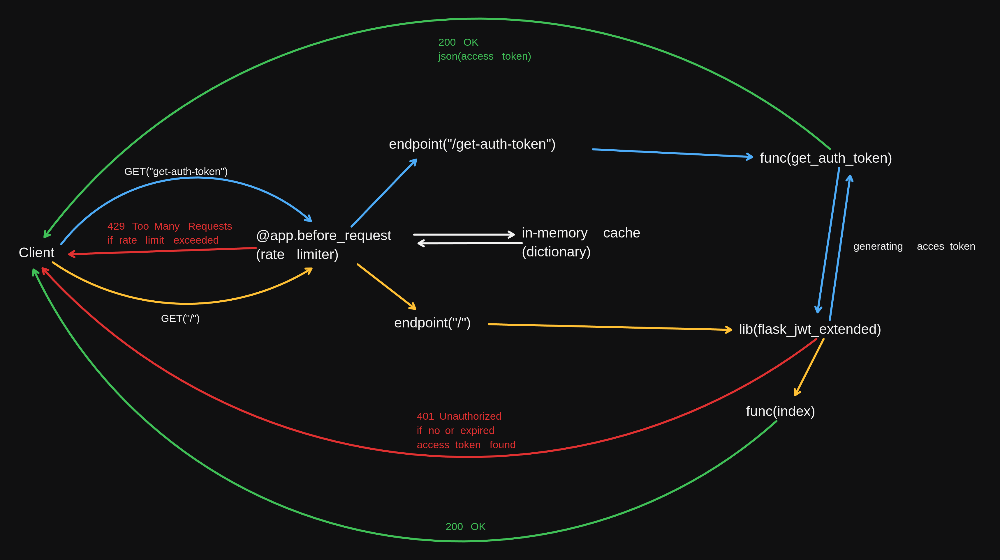

# Note 
- in an ideal environment I would have used <b>flask_limiter</b>. But for learning purpose, I have implemented it manually using a in-memory cache (a dictionary)

# Steps
-   First call the <a href="http://www.example.com:8000/get-auth-token" >http://www.example.com:8000/get-auth-token</a> to get a jwt token
-   After this call <a href="http://www.example.com:8000" >http://www.example.com:8000</a> and add the previously provided auth token in Authentication Header with Bearer
    ```
    curl -X GET http://www.example.com:8000 -H "Authorization: Bearer <YOUR_ACCESS_TOKEN>"
    ```

# Alternative approach (Recommended)
-   it is recommended to use flask_limiter library for this use case
```
from flask import Flask
from flask_limiter import Limiter
from flask_limiter.util import get_remote_address

app = Flask(__name__)

# Initialize Flask-Limiter
limiter = Limiter(get_remote_address, app=app, default_limits=["5 per minute"])

@app.route("/")
@limiter.limit("2 per second")  # Custom limit for this route
def home():
    return "Hello, World!"

if __name__ == "__main__":
    app.run(debug=True)

```

# Architecture Diagram


# Assignment 
    Backend Assignment:

    Objective: Implement a rate limiter which can throttle requests based on the IP address of the request. 

    Specifications: 
        1. Design a basic hello world API with an API key authentication on which the rate limiter is used
        2. The rate limiter should only allow 3 requests per 10 second, after which it should start sending Rate Limit exceeded error
        3. Use a cache as the backend for the rate limiter
        4. Code should either be in Python or Go
        5. Choose the rate limiting algorithm according to the use case
        6. Host it on a cloud provider of your choice (AWS, GCP or Azure)

    Submit:
        1. Github repository with the code
        2. Architecture diagram
        3. The address where it is hosted 
        4. The api key for authentication